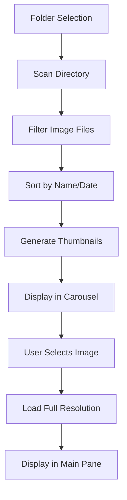
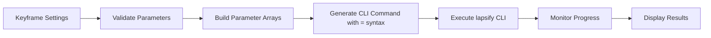

# Design Document

## Overview

The lapsify-gui is a desktop application built with Rust and the eframe/egui framework that provides a graphical interface for the existing lapsify CLI tool. The application features a three-pane layout: a main image viewer with folder selection controls, a right-side settings sidebar, and a bottom carousel for image thumbnails. The design emphasizes keyframe-based parameter animation, usability, performance, and seamless integration with the existing lapsify functionality.

## Architecture

### High-Level Architecture

```
┌─────────────────────────────────────────────────────────────┐
│                    lapsify-gui Application                   │
├─────────────────────────────────────────────────────────────┤
│  ┌─────────────────────────────────┐  ┌─────────────────┐    │
│  │         Main Viewer Pane        │  │   Right-Side    │    │
│  │    (with folder selection)      │  │    Settings     │    │
│  │                                 │  │     Sidebar     │    │
│  ├─────────────────────────────────┤  │                 │    │
│  │        Bottom Carousel          │  │                 │    │
│  │         (Thumbnails)            │  │                 │    │
│  └─────────────────────────────────┘  └─────────────────┘    │
├─────────────────────────────────────────────────────────────┤
│                    Core Application Layer                   │
│  ┌─────────────┐  ┌─────────────────┐  ┌─────────────────┐  │
│  │   Image     │  │   Keyframe      │  │   Processing    │  │
│  │  Manager    │  │   Settings      │  │    Engine       │  │
│  │             │  │   Manager       │  │                 │  │
│  └─────────────┘  └─────────────────┘  └─────────────────┘  │
├─────────────────────────────────────────────────────────────┤
│                     System Integration                      │
│  ┌─────────────┐  ┌─────────────────┐  ┌─────────────────┐  │
│  │ File System │  │   lapsify CLI   │  │     eframe      │  │
│  │   Access    │  │   Integration   │  │   Framework     │  │
│  └─────────────┘  └─────────────────┘  └─────────────────┘  │
└─────────────────────────────────────────────────────────────┘
```

### Technology Stack

- **Framework**: eframe/egui for cross-platform GUI
- **Image Processing**: image crate for loading and displaying images
- **File System**: std::fs and rfd for file dialogs
- **Threading**: tokio for async operations and image loading
- **CLI Integration**: std::process::Command for executing lapsify CLI

## Components and Interfaces

### 1. Application State (`AppState`)

Central state management for the entire application:

```rust
pub struct AppState {
    pub selected_folder: Option<PathBuf>,
    pub images: Vec<ImageInfo>,
    pub selected_image_index: Option<usize>,
    pub keyframe_settings: KeyframeSettings,
    pub processing_status: ProcessingStatus,
    pub ui_state: UiState,
}

pub struct ImageInfo {
    pub path: PathBuf,
    pub thumbnail: Option<egui::TextureHandle>,
    pub full_image: Option<egui::TextureHandle>,
    pub metadata: ImageMetadata,
}
```

### 2. Keyframe Settings Manager (`KeyframeSettings`)

Manages keyframe-based parameter animation with validation:

```rust
pub struct KeyframeSettings {
    pub num_keyframes: usize,        // 1-50, limited by image count
    pub selected_keyframe: usize,    // Currently selected keyframe index
    pub keyframe_data: Vec<KeyframeData>,
    pub is_enabled: bool,            // Disabled until folder loaded
}

pub struct KeyframeData {
    // Image adjustments (per keyframe)
    pub exposure: f32,
    pub brightness: f32,
    pub contrast: f32,
    pub saturation: f32,
    
    // Crop and positioning (per keyframe)
    pub offset_x: f32,
    pub offset_y: f32,
    
    // Other per-keyframe parameters
    pub zoom: f32,
    pub rotation: f32,
}

pub struct GlobalSettings {
    // Output settings (not keyframe-specific)
    pub format: String,
    pub fps: u32,
    pub quality: u32,
    pub resolution: Option<String>,
    pub crop: Option<String>,
    
    // Processing settings
    pub threads: usize,
    pub start_frame: Option<usize>,
    pub end_frame: Option<usize>,
}
```

### 3. Image Manager (`ImageManager`)

Handles image loading, caching, and thumbnail generation:

```rust
pub struct ImageManager {
    pub images: Vec<ImageInfo>,
    pub thumbnail_cache: HashMap<PathBuf, egui::TextureHandle>,
    pub full_image_cache: LruCache<PathBuf, egui::TextureHandle>,
}

impl ImageManager {
    pub async fn load_folder(&mut self, path: PathBuf) -> Result<(), ImageError>;
    pub async fn load_thumbnail(&mut self, path: &Path) -> Result<egui::TextureHandle, ImageError>;
    pub async fn load_full_image(&mut self, path: &Path) -> Result<egui::TextureHandle, ImageError>;
}
```

### 4. UI Components

#### Right Sidebar Panel (`RightSidebarPanel`)
- Positioned on the right side of the application
- Disabled state when no folder is loaded
- Keyframe controls at the top:
  - "Number of keyframes" slider (1-50, limited by image count)
  - "Selected keyframe" selector
- Parameter input widgets for the currently selected keyframe
- Real-time validation and error display
- No folder selection controls (moved to main panel)

#### Main Viewer Panel (`MainViewerPanel`)
- Folder selection controls (moved from sidebar)
- Image display with zoom and pan capabilities
- Fit-to-window and actual-size viewing modes
- Image metadata display
- Navigation controls (previous/next)

#### Carousel Panel (`CarouselPanel`)
- Horizontal scrollable thumbnail strip
- Selection highlighting
- Lazy loading of thumbnails
- Drag-and-drop reordering support

### 5. Processing Engine (`ProcessingEngine`)

Integrates with the lapsify CLI for actual processing:

```rust
pub struct ProcessingEngine {
    pub current_job: Option<ProcessingJob>,
    pub progress_receiver: Option<Receiver<ProcessingProgress>>,
}

pub struct ProcessingJob {
    pub input_folder: PathBuf,
    pub output_folder: PathBuf,
    pub keyframe_settings: KeyframeSettings,
    pub global_settings: GlobalSettings,
    pub status: JobStatus,
}
```

## Data Models

### Image Data Flow



### Keyframe Settings Data Model

The keyframe-based settings model supports parameter animation:

- **Keyframe Arrays**: Each parameter has values for each keyframe, interpolated by lapsify CLI
- **CLI Format**: Arrays passed with '=' syntax (e.g., --exposure=-2,1.2,4)
- **Selected Keyframe**: UI shows/edits values for currently selected keyframe
- **Validation**: Real-time validation with visual feedback per keyframe
- **State Management**: Settings disabled until folder loaded
- **Persistence**: Save/load keyframe configurations to/from JSON files

### Processing Pipeline



### Keyframe Management Flow

```mermaid
graph TD
    A[Load Folder] --> B[Enable Settings Sidebar]
    B --> C[Set Max Keyframes = min(50, image_count)]
    C --> D[Initialize Keyframe Data]
    D --> E[User Selects Keyframe]
    E --> F[Update UI with Keyframe Values]
    F --> G[User Modifies Parameters]
    G --> H[Store Values for Selected Keyframe]
    H --> I[Generate Arrays for CLI]
```

## Error Handling

### Error Categories

1. **File System Errors**
   - Invalid folder selection
   - Permission issues
   - Missing files

2. **Image Processing Errors**
   - Unsupported formats
   - Corrupted files
   - Memory limitations

3. **Settings Validation Errors**
   - Out-of-range values
   - Invalid format strings
   - Incompatible parameter combinations

4. **CLI Integration Errors**
   - lapsify executable not found
   - CLI execution failures
   - Output parsing errors

### Error Display Strategy

- **Non-blocking notifications** for minor issues
- **Modal dialogs** for critical errors requiring user action
- **Inline validation** for settings with immediate feedback
- **Progress indicators** with cancellation options for long operations

## Testing Strategy

### Unit Testing

- **Settings validation logic** with comprehensive parameter ranges
- **Image loading and caching** with various file formats
- **CLI command generation** with different parameter combinations
- **Error handling** for all identified error scenarios

### Integration Testing

- **End-to-end workflow** from folder selection to video generation
- **CLI integration** with actual lapsify executable
- **File system operations** with various folder structures
- **Memory management** with large image sets

### UI Testing

- **Layout responsiveness** across different window sizes
- **User interaction flows** for common use cases
- **Accessibility** with keyboard navigation and screen readers
- **Performance** with large image collections

### Test Data

- **Sample image sets** with various formats and sizes
- **Edge cases** including empty folders, single images, and large collections
- **Invalid inputs** for robust error handling validation
- **Performance benchmarks** with realistic data sets

## Performance Considerations

### Image Loading Strategy

- **Lazy loading** of thumbnails as they become visible
- **Background loading** of full-resolution images
- **LRU cache** for full images to manage memory usage
- **Async loading** to prevent UI blocking

### Memory Management

- **Thumbnail size limits** (e.g., 200x200 pixels maximum)
- **Cache size limits** based on available system memory
- **Garbage collection** of unused textures
- **Progressive loading** for very large image sets

### UI Responsiveness

- **Frame rate targeting** (60 FPS for smooth interactions)
- **Async operations** for all file system and processing tasks
- **Progress indicators** for operations taking >100ms
- **Cancellation support** for long-running operations

## Security Considerations

### File System Access

- **Sandboxed file access** through system dialogs
- **Path validation** to prevent directory traversal
- **Permission checking** before file operations
- **Safe temporary file handling** for processing

### CLI Integration

- **Parameter sanitization** to prevent command injection
- **Output validation** from CLI execution
- **Error message filtering** to prevent information disclosure
- **Process isolation** for CLI execution